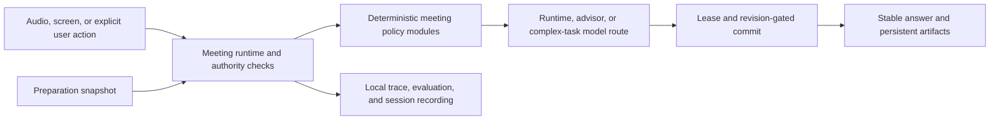

# Jarvis Architecture

This file is the tracked, privacy-safe architecture map for a clean checkout.
It intentionally excludes interview content, transcripts, memories, provider
credentials, and local working decisions.

## Core Rule

AI handles ambiguous interpretation and answer generation. The runtime owns
state, transitions, evidence boundaries, artifact authority, stale-result
rejection, persistence, and recovery.



## Ownership Boundaries

- `src/hooks/useMeetingAssistant.ts` composes the current meeting runtime. It is
  still a migration boundary, not permission to add more independent state
  authorities.
- `src/lib/meeting/` contains deterministic policies for question ownership,
  task settlement, model routing, generation leases, artifacts, evaluation,
  and recording projections.
- `MeetingContextManager` and `ActiveMeetingTask` expose the current task
  projection. The next-major migration converges remaining legacy mutable roots
  behind one reducer-owned authority.
- `src/lib/preparation/` owns Interview Preparation Workspace services and the
  immutable snapshot context consumed by meeting runtime adapters.
- `src/lib/memory/` owns local retrieval and KMB boundaries. Generated answers
  are not factual evidence merely because a model produced them.
- `src-tauri/src/` owns native capture, audio lifecycle, windows, local file
  operations, and Tauri command registration.
- Provider adapters may call configured external models, but they do not own
  meeting task state or visible artifact commit authority.

## Runtime Commit Contract

Every asynchronous result is accepted only when its identity still matches the
current session, runtime epoch, logical question, task revision, manual action
revision, artifact owner, and visible-answer revision required by that
operation. A late result may finish, but it cannot mutate current state after
its lease becomes stale.

Screen capture and explicit user actions are stronger evidence than passive
speech. They can request resettlement, but still pass through the same commit
and artifact authority boundaries.

## Persistence Boundaries

- Application data is local by default.
- Session Recording and STT evaluation capture are explicit, local evaluation
  features with separate lifecycle ownership.
- Preparation materials, extraction runs, reviewed statements, and snapshots
  use database and local-file boundaries owned by Preparation services.
- Historical formats remain readable only through explicit migration or replay
  readers; live producers must not depend on those readers.

## Architecture Guardrails

The tracked contracts in [architecture/](architecture/README.md) reject:

- new task mutation callsites outside the current allowlist;
- live imports from the historical-reader boundary;
- new import cycles or new edges inside known cycle components;
- new consumers of the broad meeting barrel;
- Tauri command/event registry drift and unexplained cross-side mismatches;
- recurrence of a surface marked deleted in the deletion ledger.

The initial baseline records 18 task-mutation callsites in 2 modules, 0 live
legacy-reader imports, 5 cycle components with 501 internal edges, 7 broad
meeting-barrel consumers, and 7 explained command-registration exceptions.
These are debt ceilings: intentional cleanup may lower them, while increases
require explicit architecture review.

## Verification

```bash
npm run verify:architecture
npm run verify:next-major
```

The fast command performs offline static checks. The full command adds the
TypeScript test suite, production frontend build, and Rust compile check, then
writes a privacy-safe report under `.tmp-architecture/`.

Private working documents under `docs/` are not part of the clean-checkout
contract. They remain gitignored by design.
