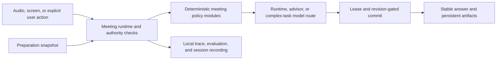

# Jarvis Architecture and Contracts

This file is the single tracked, privacy-safe architecture map for a clean
checkout. It intentionally excludes interview content, transcripts, memories,
provider credentials, local absolute paths, session-recording payloads, and
private working decisions.

## Core Rule

AI handles ambiguous interpretation and answer generation. The runtime owns
state, transitions, evidence boundaries, artifact authority, stale-result
rejection, persistence, and recovery.



## Ownership Boundaries

- `src/hooks/useMeetingAssistant.ts` composes the current meeting runtime. It is
  still a migration boundary, not permission to add more independent state
  authorities.
- `src/lib/meeting/` contains deterministic policies for question ownership,
  task settlement, model routing, generation leases, artifacts, evaluation,
  and recording projections.
- Replay shares the pure Session Procedure contract/builder in
  `src/lib/meeting/session-procedure.ts`. Its completion consumer subscribes to
  runtime-owned facts; it does not write tasks or infer display from Trace status.
  The Debug-only `read_runtime_regression_file` command reads bounded JSON/images,
  verifies reviewed digests and confines relative assets to their canonical root.
  Absolute asset access is explicit; release builds reject this command. This is
  a source loader, not a second Screen solver or a general filesystem writer.
  Historical import is explicit and writes a separate V2 Procedure, retaining
  original provenance and observed input order. Default scripted compilation stays
  V1. Both versions use the same Runner; new runs are always forced-scripted.
  Imported labels are comparison evidence, never automatic human truth for a new
  answer. Practice without Expected remains unevaluated. Missing source/clock
  evidence is reported rather than reconstructed from model output.
- `MeetingContextManager` privately owns the only live mutable
  `MeetingTaskRuntimeState`. `ActiveMeetingTask` is its read projection. The
  recognized external task writers pass through transition or clear entry
  points. Reads are pure; expiration uses the existing command at input/manual
  admission and delayed settlement boundaries and the existing periodic timer.
  Store and lifecycle reducers share command-field limits. Ordinary execution
  plans are cloned and frozen; legal rebasing produces a new plan.
- Context source groups resolve effective revisions once per construction. Initial
  Advisor context and final settled context retain distinct scopes/read moments;
  they use the shared projection rules without a cross-request cache. Generation
  continuity is excluded from Type/Relation/RO source evidence and retrieval facts.
- Final Them Voice/Replay inputs pass one language-admission check after sentence
  buffering and before setup, metadata or question publication. The independent
  Decisions provider uses a single 1.5-second queue-and-request deadline. Only a
  timely valid outside-policy choice excludes that source version; technical
  failures admit with diagnostics. Raw/display recording remains available while
  Context Manager's business reads exclude rejected versions. Explicit Force can
  restore its exact source version. A still-authorized Pause drain can retain
  context without reviving old execution. A first-parent language observation
  consumes the creation LQU's receipt after a durable new-parent commit and has no
  model, task, prompt or STT-configuration authority.
- Audio Settings owns the shared STT editor and Meeting input-language policy.
  Decisions credentials have their own standard configuration, independent of
  STT credentials. Configuration is frozen per language request. The shared
  Decisions client returns typed failures and selected-probability-first scores;
  each consumer owns its own fallback policy.
- The default-off Decisions Runtime preview selects a protocol adapter for formal
  broad Type, Response Opportunity and ordered Relation operations. Backend and
  provider configuration freeze at input admission and continue through the same
  settlement, execution-plan and task-writer chain. Screen preflight/narrow review
  and observation-only Cross-checks keep their existing routes. Type has no evidence
  request; RO targets and Affinity quotes use only the remaining stage window.
  Auxiliary failure cannot veto a valid core decision. Canonical adds no trace-only
  evidence request. Every physical request uses the existing provider admission
  coordinator with its actual configuration identity. Credentials never enter the
  source ledger or trace; changing the preview does not invalidate accepted artifacts.
- Authorized origin references resolve through the existing bounded source ledger,
  independently of the raw transcript window. Semantic topic/child-question views
  derive from those origins and honor the same selected-source scope. Canonical
  task snapshots remain unchanged for commands and historical recording. The
  96-entry ledger cap and raw-window policy are unchanged; missing sources do not
  authorize stale revisions, archive reads or generated text as source evidence.
  Pause cancels work and advances its execution epoch without resetting accepted
  context. Source birth identities remain unchanged; shared readers retain their
  session, latest-revision and owner scope checks. Resumed manual actions build new
  jobs/plans with the current execution epoch. Old work remains invalid, and Clear
  or new-session boundaries still reset sources. A source's continued readability
  never revives an old execution lease.
- `src/lib/preparation/` owns Interview Preparation Workspace services and the
  immutable snapshot context consumed by meeting runtime adapters.
- `src/lib/memory/` owns local retrieval and KMB boundaries. Generated answers
  are not factual evidence merely because a model produced them.
- `src-tauri/src/` owns native capture, audio lifecycle, windows, local file
  operations, and Tauri command registration.
- Native capture control holds one generation's lease, metadata, task and signals;
  old completion cannot clear a newer generation. Genuine Quit uses one bounded
  main-window operation, waits for accepted terminal evidence, then finalizes the
  existing recorder. Timeout requires explicit Retry or confirmed Force; hide is
  not Quit, and crash/SIGKILL recovery is not promised.
- Provider adapters may call configured external models, but they do not own
  meeting task state or visible artifact commit authority.

## Runtime Commit Contract

Every asynchronous result is accepted only when its identity still matches the
current session, runtime epoch, logical question, task revision, manual action
revision, artifact owner, and visible-answer revision required by that
operation. A late result may finish, but it cannot mutate current state after
its lease becomes stale.

Screen capture and explicit user actions are stronger evidence than passive
speech. They can request resettlement, but still pass through the same commit
and artifact authority boundaries.

## Persistence Boundaries

- Application data is local by default.
- Session Recording and STT evaluation capture are explicit, local evaluation
  features with separate lifecycle ownership.
- Preparation materials, current extraction output, reviewed statements, and
  snapshots use database and local-file boundaries owned by Preparation
  services. Completed extraction outputs/chunks are immutable; selected and
  candidate revisions are distinct. KMB content revisions are immutable while
  current selection, enabled policy and usage remain on logical rows. Rebuild
  publishes through a single native database transaction. Snapshot commits and
  activation verify exact revision/hash/policy pins at the SQL boundary.
- Recording prepares fallible startup before resetting live runtime. A failed
  terminal save retains an inactive sealed owner for Retry or explicit Abandon.
  Manifest replacement is atomic per file, not a multi-file/power-loss guarantee.
- Legacy ordinary Chat startup migration is removed; current SQLite Chat APIs
  remain, and old localStorage blobs are neither imported nor deleted.
- Historical formats remain readable only through explicit migration or replay
  readers; live producers must not depend on those readers.
- Unverifiable historical Snapshot pins remain inspectable, not newly authorized.
  Runtime pinning uses the checked reader. Source history is not manufactured
  from current content.
- Committed generated continuity lives in the existing bounded output holder:
  the current parent's answer pair, current-child summary and bounded recent
  capsules. Pure Answer publication does not write task state/revisions. Read-only
  Advisor projections may include these summaries under existing scope rules.
- Deadlines have one lifecycle-control owner in Context Manager, outside task
  semantic state. Source/manual commands carry explicit deadline deltas; authorized
  output installs its prepared deadline through shared publication. Unpublished,
  stale or failed candidates cannot renew; pending does not restart its clock.
  Actual expiry remains a task mutation. Old pure-output task writeback and its
  dedicated same-owner task rebase are removed; real task/output freshness remains.

## Tracked Contract Files

No file in this directory may contain transcripts, screenshots, memory content,
local absolute paths, provider secrets, or session-recording payloads.

- `deletion-ledger.schema.json` defines the deletion-governance record.
- `deletion-ledger.json` maps each planned breaking removal to its replacement,
  persistence impact, proof commands, deletion gate, and rollback boundary.
- `architecture-contract.json` records current authority locations, known
  dependency cycles, broad-barrel consumers, Tauri IPC/events, and explained
  cross-side exceptions.
- `orchestration-replay-baseline.json` pins the full canonical state and ordered journal for a real
  generation-lease replay where a newer result commits before a stale result.
- `verification-budget.json` records measured gate durations and the 20 percent
  investigation thresholds used by the full verifier.

## Architecture Guardrails

Current verified source checkpoint: `cf23c8cf7581d4baa8b0d1a76a188f791dd2ea7c`
(October 1, 2026). The analyzer passes with 10 task-writer callsites in two
modules, no live legacy-reader imports, one cycle with 17 edges, six broad-barrel
consumers, 72 registered commands, 73 recognized frontend calls, no known
IPC exceptions, and 38 deleted ledger entries. These are scanner metrics, not a
claim that registered-command and call counts form a one-to-one mapping.

The contract's `sourceCommit` identifies the source checkpoint last reconciled
with its existing policy. It is not the creation date of every rule or evidence
that all product acceptance criteria passed. This reconciliation changes only
that metadata; mutation allowances, dependency restrictions and exceptions remain
unchanged. Historical checkpoints below keep their original scanner scope.

The tracked contracts in this directory reject:

- new task mutation callsites outside the current allowlist;
- live imports from the historical-reader boundary;
- new import cycles or new edges inside known cycle components;
- new consumers of the broad meeting barrel;
- Tauri command/event registry drift and unexplained cross-side mismatches;
- recurrence of a surface marked deleted in the deletion ledger.

The initial guard ceiling recorded 18 task-mutation callsites in 2 modules, 0
live legacy-reader imports, 5 cycle components with 501 internal edges, 7 broad
meeting-barrel consumers, and 7 explained command-registration exceptions. The
September 4 Task 190 dependency cut leaves 2 analyzer-recognized
transition/clear callsites in 1 module, 0 live legacy imports, 6 cycle
components with 83 internal edges, a largest component of 16 modules, and 7
broad barrel consumers. The extra component is the result of splitting the
former 135-module component, not a new feedback edge. The task-writer metric is
scanner-specific and does not count expiration mutation. The checked baseline
was then ratcheted to those actual components and edges.

The September 10 target-boundary migration leaves 5 components and 41 internal
edges, all outside the selected Meeting boundary. The graph includes static,
inline-type and literal dynamic imports, re-exports and self cycles. Protected
Meeting modules and their moved contracts must remain acyclic. Contract modules
have explicit allowed data/foundation dependencies; the ID leaf has none. These
guards prevent moving a dependency behind a barrel or type query to hide it.
The existing task-writer and unrelated IPC/barrel boundaries are unchanged.

At the `c85732c` checkpoint, the analyzer reported 5 components with 39 internal
edges, 6 broad-barrel consumers and 27 deleted ledger entries. The September 24
cleanup reduced this to 1 component with 17 edges and 31 deleted ledger entries;
the 6 broad-barrel consumers remain. The scanner now includes prepared transition
and deadline installation/rollback APIs, recognizing 11 task-writer callsites in
2 modules. That count increase reflects broader discovery of existing callers,
not new runtime writers. The older counts are checkpoints under their stated
analyzer and commit. The named-API scanner does not prove discovery of arbitrary
aliases, reflection or future mutation methods.

## Verification

```bash
npm run verify:deletion-ledger
npm run verify:architecture
npm run verify:next-major
```

`verify:architecture` is the fast local gate. `verify:next-major` runs every
configured gate in order: architecture (including deletion-ledger validation),
JS/TS tests, frontend build and `cargo check`. It writes
`.tmp-architecture/next-major-verification-report.json`.
The report records the current commit, dirty-file count, command, duration, gate
status, and budget comparison without recording file contents.

`cargo test`, native/UI smoke and recorded product validation are separate evidence.
The standalone ledger command is a focused convenience, not an additional required
step before architecture. Duration-budget overruns warn; malformed present budget
configuration fails. These are locally invoked gates; this repository does not
currently contain a CI workflow that proves remote push enforcement.

Private working documents under `docs/` are not part of the clean-checkout
contract. They remain gitignored by design.

## Updating A Baseline

Do not regenerate a contract merely to make a failure disappear.

1. Confirm the code change is intentional and covered by its task brief.
2. Prefer reducing writers, cycles, barrel consumers, and IPC exceptions.
3. Run the focused tests that prove the replacement boundary.
4. Review the observed inventory against the existing policy. The
   `--write-baseline --force-baseline` path preserves that policy, including
   `imports.acyclicModules`, `imports.contractDependencies` and exception reasons;
   missing or malformed policy fails explicitly. It does not automatically grant
   permission to observed callers or edges. Intentional permission changes require
   an explicitly reviewed contract diff; inspect the complete generated diff.
5. Review every generated IPC exception reason; replace generic text with a
   concrete owner and rationale before commit.
6. Run `npm run verify:next-major` and inspect the generated report.

Removing a stale exception or lowering a ceiling is expected. Raising a ceiling
requires explicit review.
