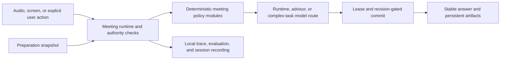

# Jarvis Architecture and Contracts

This file is the single tracked, privacy-safe architecture map for a clean
checkout. It intentionally excludes interview content, transcripts, memories,
provider credentials, local absolute paths, session-recording payloads, and
private working decisions.

## Core Rule

AI handles ambiguous interpretation and answer generation. The runtime owns
state, transitions, evidence boundaries, artifact authority, stale-result
rejection, persistence, and recovery.



## Ownership Boundaries

- `src/hooks/useMeetingAssistant.ts` composes the current meeting runtime. It is
  still a migration boundary, not permission to add more independent state
  authorities.
- `src/lib/meeting/` contains deterministic policies for question ownership,
  task settlement, model routing, generation leases, artifacts, evaluation,
  and recording projections.
- `MeetingContextManager` privately owns the only live mutable
  `MeetingTaskRuntimeState`. `ActiveMeetingTask` is its read projection. The
  recognized external task writers pass through transition or clear entry
  points; expiration is still a mutation-capable read side effect and remains a
  Task 151 convergence item.
- `src/lib/preparation/` owns Interview Preparation Workspace services and the
  immutable snapshot context consumed by meeting runtime adapters.
- `src/lib/memory/` owns local retrieval and KMB boundaries. Generated answers
  are not factual evidence merely because a model produced them.
- `src-tauri/src/` owns native capture, audio lifecycle, windows, local file
  operations, and Tauri command registration.
- Provider adapters may call configured external models, but they do not own
  meeting task state or visible artifact commit authority.

## Runtime Commit Contract

Every asynchronous result is accepted only when its identity still matches the
current session, runtime epoch, logical question, task revision, manual action
revision, artifact owner, and visible-answer revision required by that
operation. A late result may finish, but it cannot mutate current state after
its lease becomes stale.

Screen capture and explicit user actions are stronger evidence than passive
speech. They can request resettlement, but still pass through the same commit
and artifact authority boundaries.

## Persistence Boundaries

- Application data is local by default.
- Session Recording and STT evaluation capture are explicit, local evaluation
  features with separate lifecycle ownership.
- Preparation materials, current extraction output, reviewed statements, and
  snapshots use database and local-file boundaries owned by Preparation
  services. Immutable extraction runs are a pending next-major migration, not a
  current persistence guarantee.
- Historical formats remain readable only through explicit migration or replay
  readers; live producers must not depend on those readers.

## Tracked Contract Files

No file in this directory may contain transcripts, screenshots, memory content,
local absolute paths, provider secrets, or session-recording payloads.

- `deletion-ledger.schema.json` defines the deletion-governance record.
- `deletion-ledger.json` maps each planned breaking removal to its replacement,
  persistence impact, proof commands, deletion gate, and rollback boundary.
- `architecture-contract.json` records current authority locations, known
  dependency cycles, broad-barrel consumers, Tauri IPC/events, and explained
  cross-side exceptions.
- `orchestration-replay-baseline.json` pins the canonical digest for a real
  generation-lease replay where a newer result commits before a stale result.
- `verification-budget.json` records measured gate durations and the 20 percent
  investigation thresholds used by the full verifier.

## Architecture Guardrails

The tracked contracts in this directory reject:

- new task mutation callsites outside the current allowlist;
- live imports from the historical-reader boundary;
- new import cycles or new edges inside known cycle components;
- new consumers of the broad meeting barrel;
- Tauri command/event registry drift and unexplained cross-side mismatches;
- recurrence of a surface marked deleted in the deletion ledger.

The initial guard ceiling recorded 18 task-mutation callsites in 2 modules, 0
live legacy-reader imports, 5 cycle components with 501 internal edges, 7 broad
meeting-barrel consumers, and 7 explained command-registration exceptions. The
September 4 Task 190 dependency cut leaves 2 analyzer-recognized
transition/clear callsites in 1 module, 0 live legacy imports, 6 cycle
components with 83 internal edges, a largest component of 16 modules, and 7
broad barrel consumers. The extra component is the result of splitting the
former 135-module component, not a new feedback edge. The task-writer metric is
scanner-specific and does not count expiration mutation. The checked baseline
now rejects any new cycle component or 84th internal edge; later
maintainability tasks should continue reducing both counts.

## Verification

```bash
npm run verify:deletion-ledger
npm run verify:architecture
npm run verify:next-major
```

`verify:architecture` is the fast local gate. `verify:next-major` runs every
gate in order and writes `.tmp-architecture/next-major-verification-report.json`.
The report records the current commit, dirty-file count, command, duration, gate
status, and budget comparison without recording file contents.

Private working documents under `docs/` are not part of the clean-checkout
contract. They remain gitignored by design.

## Updating A Baseline

Do not regenerate a contract merely to make a failure disappear.

1. Confirm the code change is intentional and covered by its task brief.
2. Prefer reducing writers, cycles, barrel consumers, and IPC exceptions.
3. Run the focused tests that prove the replacement boundary.
4. For an intentional architecture-contract change, run
   `node scripts/verify-architecture.mjs --write-baseline --force-baseline`.
5. Review every generated IPC exception reason; replace generic text with a
   concrete owner and rationale before commit.
6. Run `npm run verify:next-major` and inspect the generated report.

Removing a stale exception or lowering a ceiling is expected. Raising a ceiling
requires explicit review.
