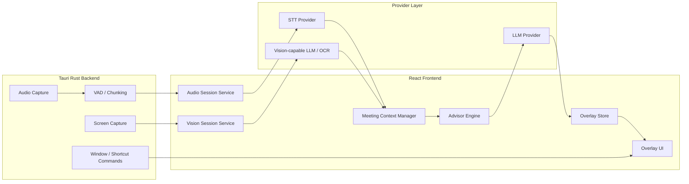

# Meeting Assistant Low-Level Design

## 1. Purpose

This document defines the low-level design for adapting the forked desktop assistant codebase into Jarvis, a real-time meeting assistant for a non-native English speaker working in software engineering.

The design uses the current Tauri + Rust + React implementation as the MVP base, while keeping clear boundaries for a future macOS-native SwiftUI/AppKit implementation if the Tauri path hits platform limits.

Primary goals:

- Capture meeting system audio and turn it into useful real-time understanding.
- Read shared screen or web/page/code content and turn it into concise context.
- Provide short, actionable suggestions in an overlay.
- Reduce the chance that the assistant UI appears in screen sharing, while avoiding any promise of absolute invisibility.
- Keep capture, transcription, vision, context, advisor, and UI concerns separate enough to migrate later.

Non-goals for the MVP:

- Guaranteed invisibility in all screen-sharing and recording paths.
- Full local-only inference for every feature.
- Enterprise policy management.
- Full meeting-notetaker workflows.
- Bot-based meeting participation.

## 2. Existing Codebase Anchors

Current Jarvis components to reuse:

- Rust system audio capture:
  - `src-tauri/src/speaker/macos.rs`
  - `src-tauri/src/speaker/commands.rs`
- Rust screen capture:
  - `src-tauri/src/capture.rs`
- Rust window and shortcut control:
  - `src-tauri/src/window.rs`
  - `src-tauri/src/shortcuts.rs`
  - `src-tauri/src/lib.rs`
- React system audio flow:
  - `src/hooks/useSystemAudio.ts`
- React completion and screenshot flow:
  - `src/hooks/useCompletion.ts`
  - `src/lib/functions/ai-response.function.ts`
  - `src/lib/functions/stt.function.ts`
- App-wide settings and providers:
  - `src/contexts/app.context.tsx`
  - `src/config/ai-providers.constants.ts`
  - `src/config/stt.constants.ts`

## 3. Architecture Overview



MVP keeps orchestration in TypeScript because the current provider and UI code already live there. Rust remains responsible for system-level capture and window capabilities.

Future native macOS migration should preserve the same conceptual modules:

- `AudioCapture`
- `Transcription`
- `ScreenObservation`
- `MeetingContext`
- `Advisor`
- `OverlayUI`
- `Permissions`

## 4. Runtime Modes

### 4.1 Meeting Assistant Mode

Default mode for this project.

Behavior:

- Captures system audio continuously while enabled.
- Runs VAD to identify speech segments.
- Sends speech segments to STT.
- Adds final transcripts to meeting context.
- Captures screen observations manually from the overlay for the MVP.
- Generates short suggestions when a new colleague turn is detected.

### 4.2 Manual Assist Mode

Fallback mode based on existing Jarvis behavior.

Behavior:

- User manually captures screenshot or audio.
- User manually asks a question.
- Existing completion flow handles response.

### 4.3 Safe Visibility Mode

Mode focused on avoiding accidental sharing.

Behavior:

- Provides one-tap hide.
- Can hide overlay before capture or screen-share-sensitive operations.
- Warns that full-screen sharing may still include the overlay depending on OS and meeting software.

## 5. Core Data Types

### 5.1 TranscriptTurn

```ts
type TranscriptSpeaker = "them" | "me" | "unknown";

interface TranscriptTurn {
  id: string;
  speaker: TranscriptSpeaker;
  text: string;
  startedAt: number;
  endedAt: number;
  isFinal: boolean;
  source: "system-audio" | "microphone";
  confidence?: number;
}
```

MVP can label all system audio as `them`. Microphone capture can be added later to distinguish `me`.

### 5.2 ScreenObservation

```ts
interface ScreenObservation {
  id: string;
  capturedAt: number;
  source: "full-screen" | "selection" | "hotkey";
  imageBase64?: string;
  ocrText?: string;
  visualSummary?: string;
  hash?: string;
  changed: boolean;
  confidence?: number;
}
```

MVP can use image-to-LLM directly. Later versions should add local OCR and hash-based change detection.

### 5.3 MeetingContextState

```ts
interface MeetingContextState {
  sessionId: string;
  startedAt: number;
  transcriptTurns: TranscriptTurn[];
  screenObservations: ScreenObservation[];
  rollingSummary: string;
  userProfileContext: string;
  glossary: GlossaryEntry[];
  lastAdvisorRequestId?: string;
}
```

### 5.4 AdvisorSuggestion

```ts
type AdvisorSuggestionKind =
  | "answer"
  | "clarifying-question"
  | "jargon"
  | "context"
  | "silent";

interface AdvisorSuggestion {
  id: string;
  kind: AdvisorSuggestionKind;
  content: string;
  createdAt: number;
  basedOnTurnIds: string[];
  basedOnObservationIds: string[];
  confidence: "low" | "medium" | "high";
}
```

## 6. Module Design

### 6.1 Audio Capture Backend

Owner: Rust.

Initial files:

- `src-tauri/src/speaker/macos.rs`
- `src-tauri/src/speaker/commands.rs`

Responsibilities:

- Create system audio tap.
- Stream output samples into a ring buffer.
- Run VAD or emit speech segments.
- Encode completed utterances as WAV base64.
- Emit Tauri events to frontend.

Existing events to reuse:

- `capture-started`
- `capture-stopped`
- `speech-start`
- `speech-detected`
- `speech-discarded`
- `audio-encoding-error`

Required improvements:

- Add a meeting-specific capture command wrapper so existing generic system audio remains stable.
- Expose current sample rate and capture source metadata.
- Add better cleanup after capture stop.
- Add device-change handling later.

Proposed new commands:

```rust
start_meeting_audio_session(config: MeetingAudioConfig) -> Result<(), String>
stop_meeting_audio_session() -> Result<(), String>
get_meeting_audio_status() -> Result<MeetingAudioStatus, String>
```

### 6.2 Transcription Service

Owner: TypeScript for MVP.

Initial files:

- New: `src/lib/meeting/transcription.service.ts`
- Existing dependency: `src/lib/functions/stt.function.ts`

Responsibilities:

- Receive WAV blob from audio session.
- Call configured STT provider.
- Normalize provider output into `TranscriptTurn`.
- Handle STT timeout and retry.
- Emit final turns into `MeetingContextManager`.

MVP behavior:

- Reuse existing `fetchSTT`.
- Treat each VAD speech segment as a final turn.
- Use `speaker: "them"`.

Future behavior:

- Support streaming STT with partial and final results.
- Add microphone capture as `speaker: "me"`.
- Trigger advisor only when `them` turn ends.

### 6.3 Screen Observation Service

Owner: TypeScript + Rust.

Initial files:

- New: `src/lib/meeting/screen-observation.service.ts`
- Existing dependency: `src-tauri/src/capture.rs`

Responsibilities:

- Capture current screen or selected region.
- Run low-frequency observation loop when enabled.
- Avoid repeated analysis of unchanged screenshots.
- Produce `ScreenObservation`.

MVP behavior:

- Use existing `capture_to_base64`.
- Trigger capture manually from the meeting overlay first.
- Keep automatic observation disabled until rate limits, privacy copy, and model cost controls are in place.
- Send screenshot-derived context to the advisor only when explicitly triggered.

Future behavior:

- Add local OCR.
- Add hash/diff change detection.
- Add region-of-interest extraction.
- Add ScreenCaptureKit/Apple Vision path in native macOS spike.

### 6.4 Meeting Context Manager

Owner: TypeScript.

New files:

- `src/lib/meeting/context-manager.ts`
- `src/lib/meeting/types.ts`

Responsibilities:

- Maintain rolling transcript window.
- Maintain recent screen observations.
- Maintain rolling summary.
- Maintain user profile context and glossary.
- Build compact prompt input for advisor.
- Enforce token and privacy limits.

Retention policy:

- Raw audio: never persisted by default.
- Screenshots: not persisted by default for meeting mode.
- Transcripts and suggestions: in memory for MVP, optional local save later.
- User profile and glossary: local storage or existing secure storage.

### 6.5 Advisor Engine

Owner: TypeScript.

New files:

- `src/lib/meeting/advisor-engine.ts`
- `src/lib/meeting/advisor-prompt.ts`

Responsibilities:

- Decide whether a new transcript turn needs advice.
- Build model prompt from context.
- Stream LLM response.
- Cancel stale in-flight requests when a newer turn arrives.
- Normalize output into `AdvisorSuggestion`.

Trigger rules:

- Trigger on final `them` turn.
- Debounce 500-1000 ms.
- Skip small talk when confidence is high.
- Cancel older advisor request if a new turn arrives.

Prompt output policy:

- Prefer 1-3 short bullets.
- Include plain-English explanation when useful.
- Include a ready-to-say English answer when the user is likely expected to respond.
- Include a clarifying question when confidence is low.
- Avoid long essays.

### 6.6 Overlay Store and UI

Owner: React.

New files:

- `src/pages/app/components/meeting/*`
- `src/hooks/useMeetingAssistant.ts`
- `src/lib/meeting/overlay-store.ts`

Responsibilities:

- Show current listening/capture status.
- Show latest transcript snippet.
- Show current suggestions.
- Provide pause/resume/hide controls.
- Expose shortcuts.

MVP UI shape:

- Compact top overlay.
- Sections:
  - Meaning
  - Suggested reply
  - Clarifying question
- Minimal text, no dashboard-style marketing.

## 7. Event Flow

### 7.1 Audio-to-Advice Flow

1. User toggles meeting assistant.
2. Frontend calls `start_meeting_audio_session`.
3. Rust captures system audio and emits `speech-detected` with WAV base64.
4. Frontend converts base64 to blob.
5. `TranscriptionService` calls STT.
6. `MeetingContextManager` appends a `TranscriptTurn`.
7. `AdvisorEngine` checks trigger rules.
8. Existing `fetchAIResponse` streams the answer.
9. Overlay renders suggestions as chunks arrive.

### 7.2 Screen-to-Context Flow

1. User presses screen-context hotkey or auto observation interval fires.
2. Frontend calls `capture_to_base64`.
3. Screen service computes basic hash if available.
4. If changed, screenshot is analyzed.
5. Observation is appended to context.
6. Next advisor request includes latest relevant screen context.

## 8. Provider Strategy

MVP:

- Reuse existing AI and STT provider configuration.
- Use BYOK/custom providers only; do not ship a hosted default provider for this personal fork.
- Treat STT provider configuration as required before meeting capture starts.
- Treat AI provider configuration as required for live suggestions, while allowing transcript capture to continue if the AI provider is missing.
- Prefer low-latency cloud STT and LLM providers during personal testing, configured through the existing Jarvis custom curl flow.

Future:

- Add streaming STT provider abstraction.
- Add local STT option.
- Add local OCR option.
- Add local LLM option for privacy mode.

## 9. Privacy and Visibility Boundaries

The app should not promise absolute invisibility during screen sharing.

Implementation stance:

- Use transparent overlay, content protection, skip taskbar, and platform-specific panel behavior.
- Provide a reliable hide shortcut.
- Hide overlay during self-capture where possible.
- Prefer single-window sharing or second display use.
- Do not claim "undetectable" or "guaranteed hidden" in product text.

Data stance:

- Do not persist raw audio by default.
- Do not persist raw screenshots by default in meeting mode.
- Make any cloud upload explicit through provider settings.
- Add a future privacy mode selector:
  - Local only
  - Text to cloud
  - Text and selected images to cloud

## 10. Error Handling

Audio errors:

- Permission denied: show setup prompt.
- Capture already running: recover by stopping previous task and retrying once.
- Empty speech: ignore unless repeated.
- STT timeout: show concise warning and continue listening.

Screen errors:

- Screen recording permission missing: show setup prompt.
- Capture failure: disable screen context, keep audio assistant running.

LLM errors:

- Provider missing: show setup prompt.
- Network failure: keep transcript visible, pause suggestions.
- Slow response: allow cancel and replace.

## 11. Testing Strategy

Unit tests:

- Context window trimming.
- Prompt builder.
- Advisor trigger rules.
- Hash/diff logic once added.
- Provider response normalization.

Integration tests:

- System audio session start/stop.
- VAD speech event to STT service.
- Screenshot capture to screen observation.
- Advisor cancellation on new turn.

Manual test matrix:

- Zoom, Google Meet, Microsoft Teams.
- Full-screen share, window share, second monitor.
- AirPods, built-in speaker, external output device.
- Screen recording permission denied/granted.
- System audio permission denied/granted.
- Long meeting session over 60 minutes.

## 12. Migration Notes for Future Native macOS Build

If Tauri blocks production quality, migrate module by module:

1. Keep prompt, context, and provider logic as portable TypeScript reference or rewrite as Swift packages.
2. Replace Rust audio capture with Swift Core Audio tap package.
3. Replace screenshot loop with ScreenCaptureKit.
4. Replace screenshot-to-vision with Apple Vision OCR plus multimodal fallback.
5. Replace React overlay with `NSPanel` + SwiftUI `NSHostingView`.

The MVP should avoid hard-coding meeting logic into React components so this migration remains realistic.

## 13. Resolved MVP Decisions

Date: 2026-05-08

- First supported platform: macOS only.
- Provider default: BYOK/custom provider configuration only; no hosted commercial default.
- Transcript retention: in memory only for the MVP.
- Raw audio retention: never persist by default.
- Screenshot retention: never persist by default in meeting mode.
- Microphone capture: excluded from v1; system audio turns are labeled `them` or `unknown`.
- Screen context: manual overlay capture first; automatic observation is a later opt-in feature.
- Visibility wording: screen-share resistant, not invisible or undetectable.

## 14. Remaining Open Questions

- Which concrete STT provider gives the best latency and accuracy for the user's real meetings?
- Which concrete LLM provider is fast enough for live suggestions under BYOK?
- Should Jarvis add local OCR before multimodal screenshot analysis?
- What exact hide shortcut and screen-share workflow feel safest in daily use?
