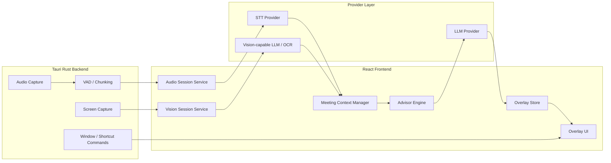

# Meeting Assistant Low-Level Design

## 1. Purpose

This document defines the low-level design for adapting the forked desktop assistant codebase into Jarvis, a real-time meeting assistant for a non-native English speaker working in software engineering.

The design uses the current Tauri + Rust + React implementation as the MVP base, while keeping clear boundaries for a future macOS-native SwiftUI/AppKit implementation if the Tauri path hits platform limits.

Primary goals:

- Capture meeting system audio and turn it into useful real-time understanding.
- Read shared screen or web/page/code content and turn it into concise context.
- Provide short, actionable suggestions in an overlay.
- Reduce the chance that the assistant UI appears in screen sharing, while avoiding any promise of absolute invisibility.
- Keep capture, transcription, vision, context, advisor, and UI concerns separate enough to migrate later.

Non-goals for the MVP:

- Guaranteed invisibility in all screen-sharing and recording paths.
- Full local-only inference for every feature.
- Enterprise policy management.
- Full meeting-notetaker workflows.
- Bot-based meeting participation.

## 2. Existing Codebase Anchors

Current Jarvis components to reuse:

- Rust system audio capture:
  - `src-tauri/src/speaker/macos.rs`
  - `src-tauri/src/speaker/commands.rs`
- Rust screen capture:
  - `src-tauri/src/capture.rs`
- Rust window and shortcut control:
  - `src-tauri/src/window.rs`
  - `src-tauri/src/shortcuts.rs`
  - `src-tauri/src/lib.rs`
- React system audio flow:
  - `src/hooks/useSystemAudio.ts`
- React completion and screenshot flow:
  - `src/hooks/useCompletion.ts`
  - `src/lib/functions/ai-response.function.ts`
  - `src/lib/functions/stt.function.ts`
- App-wide settings and providers:
  - `src/contexts/app.context.tsx`
  - `src/config/ai-providers.constants.ts`
  - `src/config/stt.constants.ts`

## 3. Architecture Overview



MVP keeps orchestration in TypeScript because the current provider and UI code already live there. Rust remains responsible for system-level capture and window capabilities.

Future native macOS migration should preserve the same conceptual modules:

- `AudioCapture`
- `Transcription`
- `ScreenObservation`
- `MeetingContext`
- `Advisor`
- `OverlayUI`
- `Permissions`

## 4. Runtime Modes

### 4.1 Meeting Assistant Mode

Default mode for this project.

Behavior:

- Captures system audio continuously while enabled.
- Runs VAD to identify speech segments.
- Sends speech segments to STT.
- Adds final transcripts to meeting context.
- Captures screen observations manually from the overlay or the meeting screen-context hotkey, preferring the frontmost active window for meeting context.
- For explicit screen captures, treats the visible technical question as the primary task and produces a structured answer directly from the vision-capable provider.
- Uses later transcript turns as clarification, modification, or follow-up context for the active screen task.
- Generates short suggestions when a new colleague turn is detected and no active screen task is in focus.
- Allows manual suggestion refinement through regenerate and make-shorter actions.

### 4.2 Manual Assist Mode

Fallback mode based on existing Jarvis behavior.

Behavior:

- User manually captures screenshot or audio.
- User manually asks a question.
- Existing completion flow handles response.

### 4.3 Safe Visibility Mode

Mode focused on avoiding accidental sharing.

Behavior:

- Provides one-tap hide.
- Can hide overlay before capture or screen-share-sensitive operations.
- Warns that full-screen sharing may still include the overlay depending on OS and meeting software.

## 5. Core Data Types

### 5.1 TranscriptTurn

```ts
type TranscriptSpeaker = "them" | "me" | "unknown";

interface TranscriptTurn {
  id: string;
  speaker: TranscriptSpeaker;
  text: string;
  startedAt: number;
  endedAt: number;
  isFinal: boolean;
  source: "system-audio" | "microphone";
  confidence?: number;
}
```

MVP can label all system audio as `them`. Microphone capture can be added later to distinguish `me`.

### 5.2 ScreenObservation

```ts
interface ScreenObservation {
  id: string;
  capturedAt: number;
  source: "full-screen" | "selection" | "hotkey";
  imageBase64?: string;
  ocrText?: string;
  visualSummary?: string;
  analysisPromptSource?: "meeting-default" | "screenshot-auto-prompt";
  hash?: string;
  changed: boolean;
  confidence?: number;
  captureTarget?: ScreenCaptureTarget;
}
```

MVP uses image-to-LLM directly. Meeting mode treats `visualSummary` as the compact model-produced screen-task answer for explicit captures. Later versions should add local OCR, cursor-centered focus crops, and stronger hash-based change detection.

### 5.3 MeetingContextState

```ts
interface MeetingContextState {
  sessionId: string;
  startedAt: number;
  transcriptTurns: TranscriptTurn[];
  screenObservations: ScreenObservation[];
  activeScreenTask?: ActiveScreenTask;
  rollingSummary: string;
  userProfileContext: string;
  glossary: GlossaryEntry[];
  lastAdvisorRequestId?: string;
}
```

### 5.4 ActiveScreenTask

```ts
type ScreenTaskKind =
  | "coding"
  | "field-knowledge"
  | "ambiguous"
  | "non-question"
  | "unknown";

interface ActiveScreenTask {
  id: string;
  observationId: string;
  createdAt: number;
  updatedAt: number;
  expiresAt?: number;
  question?: string;
  kind: ScreenTaskKind;
  language?: string;
  content: string;
  basedOnTurnIds: string[];
  basedOnObservationId: string;
}
```

`ActiveScreenTask` starts on explicit screen capture. It anchors later audio turns so the advisor treats speech as clarification, modification, or follow-up context for the visible technical question. New captures replace the active task. The task can be cleared manually, clears when the meeting assistant stops, and expires after a configurable inactivity timeout. The default is 30 minutes of inactivity, long enough for a real technical discussion but short enough to avoid stale task carryover across unrelated meeting topics.

Initial user feedback on the screen-anchored implementation is positive. The remaining design risk is less about the core interaction model and more about focus selection, stale-task lifecycle, and broader meeting-scenario validation.

### 5.5 AdvisorSuggestion

```ts
type AdvisorSuggestionKind =
  | "answer"
  | "screen-task"
  | "clarifying-question"
  | "jargon"
  | "context"
  | "silent";

interface AdvisorSuggestion {
  id: string;
  kind: AdvisorSuggestionKind;
  content: string;
  createdAt: number;
  basedOnTurnIds: string[];
  basedOnObservationIds: string[];
  confidence: "low" | "medium" | "high";
}
```

## 6. Module Design

### 6.1 Audio Capture Backend

Owner: Rust.

Initial files:

- `src-tauri/src/speaker/macos.rs`
- `src-tauri/src/speaker/commands.rs`

Responsibilities:

- Create system audio tap.
- Stream output samples into a ring buffer.
- Run VAD or emit speech segments.
- Encode completed utterances as WAV base64.
- Emit Tauri events to frontend.

Existing events to reuse:

- `capture-started`
- `capture-stopped`
- `speech-start`
- `speech-detected`
- `speech-discarded`
- `audio-encoding-error`

Required improvements:

- Add a meeting-specific capture command wrapper so existing generic system audio remains stable.
- Expose current sample rate and capture source metadata.
- Add better cleanup after capture stop.
- Add device-change handling later.

Implemented meeting commands:

```rust
start_meeting_audio_session(config: MeetingAudioConfig) -> Result<MeetingAudioStatus, String>
stop_meeting_audio_session() -> Result<MeetingAudioStatus, String>
get_meeting_audio_status() -> Result<MeetingAudioStatus, String>
```

### 6.2 Transcription Service

Owner: TypeScript for MVP.

Initial files:

- New: `src/lib/meeting/transcription.service.ts`
- Existing dependency: `src/lib/functions/stt.function.ts`

Responsibilities:

- Receive WAV blob from audio session.
- Call configured STT provider.
- Normalize provider output into `TranscriptTurn`.
- Handle STT timeout and retry.
- Emit final turns into `MeetingContextManager`.

MVP behavior:

- Reuse existing `fetchSTT`.
- Treat each VAD speech segment as a final turn.
- Use `speaker: "them"`.

Future behavior:

- Support streaming STT with partial and final results.
- Add microphone capture as `speaker: "me"`.
- Trigger advisor only when `them` turn ends.

### 6.3 Screen Observation Service

Owner: TypeScript + Rust.

Initial files:

- New: `src/lib/meeting/screen-observation.service.ts`
- Existing dependency: `src-tauri/src/capture.rs`

Responsibilities:

- Capture the frontmost active window, current monitor fallback, or selected region.
- Run low-frequency observation loop when enabled.
- Compute screenshot hash metadata for future duplicate suppression and rate limiting.
- Produce `ScreenObservation`.

MVP behavior:

- Preserve existing `capture_to_base64` for the separate manual screenshot path and use a meeting-specific capture command for screen context.
- Trigger capture manually from the meeting overlay or the meeting screen-context hotkey.
- Prefer active-window capture for meeting context, using monitor-crop capture of the selected window bounds so video/share surfaces inside Zoom are captured from the composed screen image.
- Fall back to direct window capture, then current-monitor capture, when the preferred active-window path is unavailable.
- Store compact capture target metadata on each `ScreenObservation`: target type, capture method, app name, window title, monitor, image size, bounds, fallback reason, top window candidates, and an in-panel thumbnail preview.
- If Screenshot settings are in `Auto` mode and an auto prompt is configured, treat it as user preference while preserving the meeting screen-task answer contract.
- Treat explicit screen captures as visible technical tasks, not meeting dialogue; the advisor must not invent colleagues, speakers, or questions when no transcript exists.
- Treat manual and hotkey-triggered captures as explicit user intent, so they should produce visible feedback directly from the vision provider even when meeting audio is not actively listening.
- Create or replace `activeScreenTask` when a meaningful visible question is found.
- Classify the screen task as coding, field knowledge, ambiguous, non-question, or unknown.
- For coding tasks, default to Python unless the screen specifies another language and include approach, implementation, time complexity, and space complexity.
- For field-knowledge tasks, produce a concise professional answer that can be said in a meeting.
- Hide the meeting panel before hotkey self-capture where possible, then reopen it after capture so the screenshot is more likely to represent the meeting screen instead of Jarvis itself.
- Keep automatic observation disabled until rate limits, privacy copy, and model cost controls are in place.
- Send screenshot-derived context to the advisor only when explicitly triggered.

Future behavior:

- Suppress repeated analysis when automatic observation sees an unchanged screenshot hash.
- Add local OCR.
- Add stronger hash/diff change detection.
- Add region-of-interest extraction.
- Add ScreenCaptureKit/Apple Vision path in native macOS spike.

### 6.4 Meeting Context Manager

Owner: TypeScript.

New files:

- `src/lib/meeting/context-manager.ts`
- `src/lib/meeting/types.ts`

Responsibilities:

- Maintain rolling transcript window.
- Maintain recent screen observations.
- Maintain the active screen task created by explicit screen capture.
- Maintain rolling summary.
- Maintain user profile context and glossary.
- Build compact prompt input for advisor.
- Enforce token and privacy limits.

Retention policy:

- Raw audio: never persisted by default.
- Screenshots: not persisted by default for meeting mode.
- Transcripts and suggestions: in memory for MVP, optional local save later.
- User profile and glossary: local storage or existing secure storage.

### 6.5 Advisor Engine

Owner: TypeScript.

New files:

- `src/lib/meeting/advisor-engine.ts`
- `src/lib/meeting/advisor-prompt.ts`

Responsibilities:

- Decide whether a new transcript turn needs advice.
- Build model prompt from context.
- Stream LLM response.
- Cancel stale in-flight requests when a newer turn arrives.
- Normalize output into `AdvisorSuggestion`.
- Support explicit regenerate and make-shorter requests against the current meeting context.
- In `screen-anchored` mode, use `activeScreenTask` as the anchor and treat the newest transcript turn as clarification or follow-up.

Trigger rules:

- Trigger on final `them` turn.
- If an `activeScreenTask` exists, run the advisor in `screen-anchored` mode for later transcript turns.
- Debounce 500-1000 ms.
- Skip small talk when confidence is high.
- Cancel older advisor request if a new turn arrives.

Prompt output policy:

- Prefer 1-3 short bullets.
- Include plain-English explanation when useful.
- Include a ready-to-say English answer when the user is likely expected to respond.
- Include a clarifying question when confidence is low.
- Avoid long essays.
- For screen-anchored technical questions, use structured sections: `Question`, `Answer`, `Approach`, `Code`, `Complexity`, and `Clarifying question`.

### 6.6 Overlay Store and UI

Owner: React.

New files:

- `src/pages/app/components/meeting/*`
- `src/hooks/useMeetingAssistant.ts`
- `src/lib/meeting/overlay-store.ts`

Responsibilities:

- Show current listening/capture status.
- Show latest transcript snippet.
- Show current suggestions.
- Provide pause/resume/hide controls.
- Provide privacy mode and screen-context controls.
- Provide regenerate and shorter controls for suggestions.
- Provide one-click clarifying-question controls: `Yes`, `No`, `Not sure`, and `Dismiss`.
- Expose shortcuts.

MVP UI shape:

- Compact top overlay.
- Expanded Meeting Assistant uses a fixed target width, clamped to the current monitor, and grows vertically through scrollable content rather than expanding horizontally.
- Long transcript, answer, code, complexity, debug, and error text must wrap inside the panel with horizontal overflow hidden.
- While the Meeting Assistant panel is open, the main webview temporarily overrides hidden/custom cursor styling and uses the native system cursor. This prevents cursor loss when the pointer leaves visible panel content but remains inside the transparent Tauri window rectangle.
- Normal transcript-driven sections:
  - Meaning
  - Suggested reply
  - Clarifying question
- Screen-task sections:
  - Question
  - Answer
  - Approach
  - Code
  - Complexity
  - Clarifying question
- Minimal text, no dashboard-style marketing.

### 6.7 Observability and Metrics

Owner: TypeScript for MVP.

MVP behavior:

- Keep meeting traces in memory only.
- Do not persist raw audio bytes or raw screenshots by default.
- Record screen workflow traces from capture trigger through model output and Meeting Assistant state update.
- Record voice workflow traces from speech detection through STT, transcript append, advisor request, and suggestion output.
- Store raw text prompts and raw text model/STT outputs for local debugging.
- Store image and audio metadata such as byte counts, capture target, provider ID, and timing.
- Keep Debug Mode off by default so the meeting UI stays focused during normal use.
- Expose the latest traces and last capture details in the Meeting Assistant panel only when Debug Mode is enabled.
- Emit timestamped terminal trace logs in Debug Mode, including trace lifecycle events and step durations.
- Treat screen capture as a single-flight workflow: debounce repeated custom shortcut events, ignore duplicate hotkey calls while a capture is running, and mark aborted model steps as `cancelled` rather than successful empty outputs.
- Downscale meeting screen-context images to a 2048px long edge and encode them as JPEG so model payloads stay small while preserving readable technical text.
- Use a low-latency image path for meeting screen-context captures; live response latency is more important than lossless screenshots in this workflow. The separate manual screenshot path still uses PNG, and the Tauri dev profile optimizes image-related crates so local testing reflects real meeting-time performance more closely.
- Stream partial screen-task model output into the Meeting Assistant panel as chunks arrive, reducing perceived latency from full completion time to first useful token time.
- Include native capture sub-step timings in capture metadata so slow captures can be attributed to window lookup, image capture, image optimization, or image encoding.
- Keep screen-task output structured, but render `Answer` first as the highest-priority meeting-ready content. `Question`, `Approach`, `Code`, `Complexity`, and `Clarifying question` remain available as supporting sections.

Future behavior:

- Optional trace export.
- Explicit opt-in persisted debug sessions with retention controls.
- Aggregated latency summaries for repeated scenario tests.

## 7. Event Flow

### 7.1 Audio-to-Advice Flow

1. User toggles meeting assistant.
2. Frontend calls `start_meeting_audio_session`.
3. Rust captures system audio and emits `speech-detected` with WAV base64.
4. Frontend converts base64 to blob.
5. `TranscriptionService` calls STT.
6. `MeetingContextManager` appends a `TranscriptTurn`.
7. `AdvisorEngine` checks trigger rules.
8. Existing `fetchAIResponse` streams the answer.
9. Overlay renders suggestions as chunks arrive.

### 7.2 Screen-to-Task Flow

1. User presses the screen-context hotkey or clicks the overlay screen-context button.
2. For the hotkey path, the frontend closes the meeting panel and briefly shrinks the overlay before capture where possible.
3. Frontend calls the meeting-specific capture command with `target: "active-window"`.
4. Rust selects the first suitable non-Jarvis foreground window from `xcap::Window::all()`.
5. Rust captures the monitor containing that window and crops to the active window bounds; this avoids Zoom/video host windows whose direct window backing image may not match visible content.
6. If monitor-crop capture fails, Rust falls back to direct window capture and records the fallback reason; if active-window capture fails completely, Rust falls back to the previous current-monitor capture path.
7. Rust downscales the image for screen-context use, encodes it with a low-latency JPEG path, and records capture sub-step timings.
8. Screen service computes a basic hash and stores capture target debug metadata.
9. Screenshot is analyzed by the configured vision-capable provider with a screen-anchored technical-question prompt.
10. Recent transcript turns are included as supplemental clarification, not as the primary task.
11. Screenshot Auto prompt is included as user preference if configured, but cannot override the screen-task answer contract.
12. A meaningful result creates or replaces `activeScreenTask`.
13. Overlay renders partial and final structured screen-task answer content, with `Answer` shown first and supporting sections below it.
14. Later transcript turns run `screen-anchored` advisor updates against the active task.

### 7.3 Clarifying Question Feedback Flow

1. Advisor output may include a `Question` section when context is ambiguous.
2. The Meeting Assistant UI renders quick answer controls beneath the question.
3. `Yes`, `No`, and `Not sure` send the selected answer back to the advisor as `clarifying_feedback`.
4. If an active screen task exists, the advisor updates the screen-task answer using the selected answer as an explicit constraint; otherwise it regenerates a compact meeting suggestion.
5. `Dismiss` hides the current question locally without changing meeting context.

## 8. Provider Strategy

MVP:

- Reuse existing AI and STT provider configuration.
- Use BYOK/custom providers only; do not ship a hosted default provider for this personal fork.
- Treat STT provider configuration as required before meeting capture starts.
- Treat AI provider configuration as required for live suggestions, while allowing transcript capture to continue if the AI provider is missing.
- Prefer low-latency cloud STT and LLM providers during personal testing, configured through the existing Jarvis custom curl flow.

Future:

- Add streaming STT provider abstraction.
- Add local STT option.
- Add local OCR option.
- Add local LLM option for privacy mode.

## 9. Privacy and Visibility Boundaries

The app should not promise absolute invisibility during screen sharing.

Implementation stance:

- Use transparent overlay, content protection, skip taskbar, and platform-specific panel behavior.
- Provide a reliable emergency hide path through the existing hide/show shortcut.
- Emergency hide should collapse the Meeting Assistant panel, shrink the overlay to compact height, clear cursor overrides, and keep meeting audio capture running.
- Hide overlay during self-capture where possible.
- Prefer single-window sharing or second display use.
- Do not claim "undetectable" or "guaranteed hidden" in product text.

Data stance:

- Do not persist raw audio by default.
- Do not persist raw screenshots by default in meeting mode.
- Make any cloud upload explicit through provider settings.
- Provide a privacy mode selector:
  - Local only placeholder, blocked until local STT exists.
  - Text to cloud.
  - Text and selected images to cloud.

## 10. Error Handling

Audio errors:

- Permission denied: show setup prompt.
- Capture already running: recover by stopping previous task and retrying once.
- Empty speech: ignore unless repeated.
- STT timeout: show concise warning and continue listening.

Screen errors:

- Screen recording permission missing: show setup prompt.
- Capture failure: disable screen context, keep audio assistant running.

LLM errors:

- Provider missing: show setup prompt.
- Network failure: keep transcript visible, pause suggestions.
- Slow response: allow cancel and replace.

## 11. Testing Strategy

Unit tests:

- Context window trimming.
- Prompt builder.
- Advisor trigger rules.
- Hash/diff logic once added.
- Provider response normalization.

Integration tests:

- System audio session start/stop.
- VAD speech event to STT service.
- Screenshot capture to screen observation.
- Advisor cancellation on new turn.

Current automated checks:

- `npm run build`
- `cargo check`
- `git diff --check`

Manual test matrix:

- Zoom, Google Meet, Microsoft Teams.
- Full-screen share, window share, second monitor.
- AirPods, built-in speaker, external output device.
- Screen recording permission denied/granted.
- System audio permission denied/granted.
- Long meeting session over 60 minutes.

## 12. Migration Notes for Future Native macOS Build

If Tauri blocks production quality, migrate module by module:

1. Keep prompt, context, and provider logic as portable TypeScript reference or rewrite as Swift packages.
2. Replace Rust audio capture with Swift Core Audio tap package.
3. Replace screenshot loop with ScreenCaptureKit.
4. Replace screenshot-to-vision with Apple Vision OCR plus multimodal fallback.
5. Replace React overlay with `NSPanel` + SwiftUI `NSHostingView`.

The MVP should avoid hard-coding meeting logic into React components so this migration remains realistic.

## 13. Resolved MVP Decisions

Date: 2026-05-08

- First supported platform: macOS only.
- Provider default: BYOK/custom provider configuration only; no hosted commercial default.
- Transcript retention: in memory only for the MVP.
- Raw audio retention: never persist by default.
- Screenshot retention: never persist by default in meeting mode.
- Microphone capture: excluded from v1; system audio turns are labeled `them` or `unknown`.
- Screen context: manual overlay capture first; automatic observation is a later opt-in feature.
- Visibility wording: screen-share resistant, not invisible or undetectable.
- Meeting Assistant layout: use a fixed expanded panel width with wrapped content instead of letting long model responses resize the native window.
- Meeting Assistant cursor behavior: use native cursor while the expanded panel is open, then restore the normal hidden/custom cursor behavior after closing.
- Active screen task lifecycle: manual clear, stop-clear, and configurable inactivity timeout defaulting to 30 minutes.
- Emergency hide: reuse the existing hide/show shortcut as a reliable meeting-time panic action that collapses UI without stopping audio capture.

## 14. Remaining Open Questions

- Which concrete STT provider gives the best latency and accuracy for the user's real meetings?
- Which concrete LLM provider is fast enough for live suggestions under BYOK?
- Should Jarvis add local OCR before multimodal screenshot analysis?
- What screen-share workflow guidance should be documented after more Zoom, Google Meet, and Teams testing?
