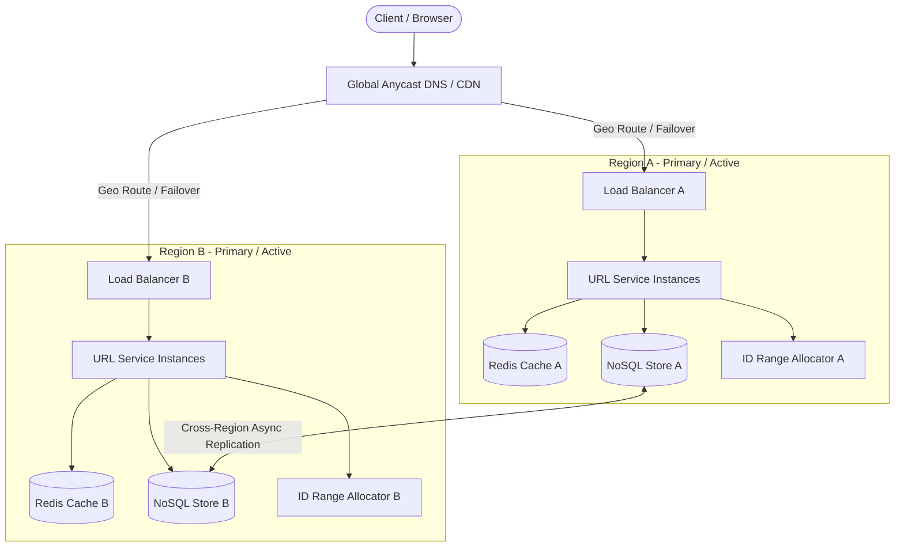

中文思路:
针对短链系统（URL Shortener）设计与多地域容灾（Multi-region failover）需求，按系统设计标准流程展开：
1. **需求与约束定义**：
   - 功能：生成短链（`createShortURL`）、短链重定向（`302/301` 跳转）、支持自定义短链与过期时间（TTL）。
   - 非功能：极高读写比（通常 100:1 以上）、读延迟毫秒级、强可用性（99.99%+）、全球多地域容灾。
2. **多地域容灾与核心技术难点**：
   - **ID 生成/哈希冲突**：使用 Base62 编码。多 Region 并发写时，ID 分配避免冲突（如分段 Range 分配 / Snowflake with Datacenter ID / UUID 前缀 / Token 服务）。
   - **多地域架构**：Active-Active 或 Active-Passive。由于读为主，采用 Multi-Region Active-Active 读，结合全局 DynamoDB Global Tables / CockroachDB / Cassandra 双向异步复制，配合 Edge CDN/Anycast DNS 路由。
   - **容灾 Failover 策略**：Anycast/Route53 自动健康检查踢除故障 Region；读流量就近 fallback；写流量在主 Region 故障时切换到备用 Range 或对端 Region。

Answer:
To design a highly available URL shortener with multi-region failover, we start with core functional and non-functional requirements, followed by high-level architecture and multi-region active-active/failover mechanics:

1. **Functional Scope**:
   - `POST /api/v1/urls`: Shorten a long URL with optional custom alias and TTL.
   - `GET /{shortCode}`: Fast HTTP 302 (for analytics) or 301 redirect to the original URL.
   - Analytics (click count, geo, timestamp) tracked asynchronously.

2. **Key Clarification Questions**:
   - What is the expected write/read QPS time basis (e.g., DAU, daily creations, peak read factor)?
   - For multi-region writes, do we prefer strict global uniqueness via pre-allocated ID ranges or eventual consistency with collision retries?
   - What is the strict RPO/RTO target during a region-level outage?

Approach:
- **Short Key Generation**:
  - Base62 encoding (`[a-zA-Z0-9]`, 7 characters provide $$62^7 \approx 3.5\text{ trillion}$$ unique URLs).
  - Distributed ID allocator per region: Each region is assigned non-overlapping ID counter blocks (e.g., Region A: 1-100M, Region B: 101-200M) via a coordination store (Etcd/ZooKeeper) to prevent collisions across regions without cross-region locks.
- **Data Model & Storage**:
  - Primary Table (`URL_Mapping`): `short_key` (PK), `long_url`, `user_id`, `created_at`, `expires_at`.
  - Distributed NoSQL/Multi-Master DB (e.g., DynamoDB Global Tables or Cassandra) with asynchronous multi-region replication.
- **Caching Layer**:
  - Distributed Redis cluster (LRU eviction) in each region caching popular short URLs ($$80/20$$ rule).
- **Multi-Region Failover Architecture**:
  - **Routing**: Global DNS (Route 53 / Cloudflare Anycast) with health checks routing users to the closest healthy region.
  - **Read Failover**: Region outage immediately diverts DNS traffic to the surviving region. Since DB replication is active-active, read latency remains local with minimal lag.
  - **Write Failover**: Surviving region continues issuing keys from its locally allocated range. Conflict-free ID allocation eliminates split-brain risks during network partitions.

Whiteboard:

Code:
-

Complexity:
-

Question:
Design a URL shortener. Start with requirements and a high-level architecture. Refine the same design for multi-region failover.

Clarifying question:
What are the expected daily active users (DAU) and write/read traffic ratios to size the database and cache capacity?

Clarifying options:
- 10M DAU, 100:1 read/write ratio (Read-heavy)
- 100M+ DAU global scale with strict < 50ms read latency SLA
- Custom short URLs with high write burst requirements

Answer disposition: not-fact-dependent
Supporting anchor IDs: -
